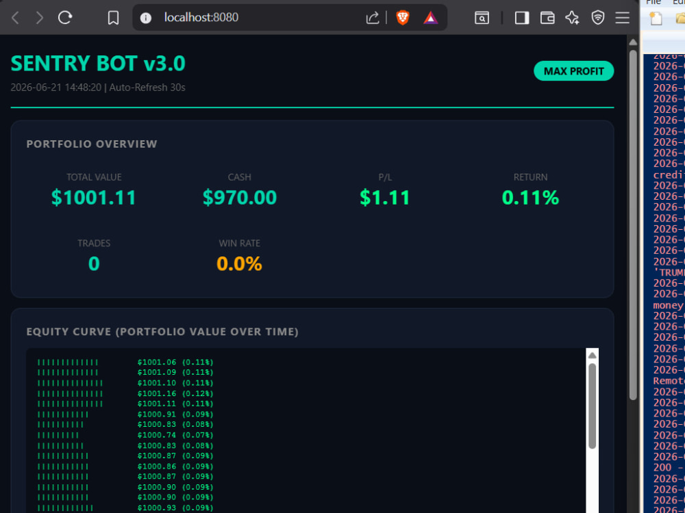
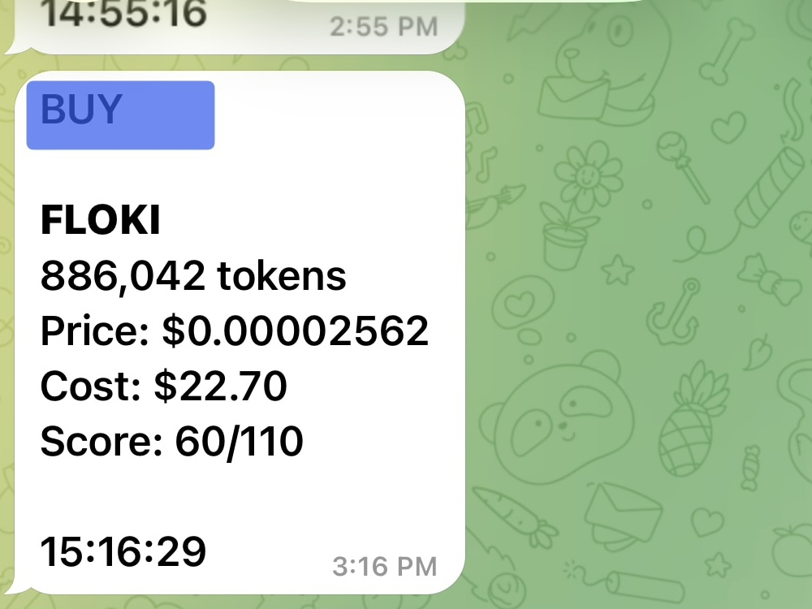

# Sentry

> Open-source Solana memecoin trading bot for market scanning, signal scoring, risk management, and paper trading.

<p align="center">
  
  &nbsp;
  
</p>

Sentry continuously monitors crypto markets, filters token candidates, evaluates multiple signals, and sends trading alerts while managing a simulated portfolio.

## How It Works

```text
Discover → Filter → Score → Risk Check → Entry → Monitor → Exit
```

### Signals

Sentry evaluates multiple factors before considering a trade:

- Market momentum
- Volume and liquidity
- RSI
- On-chain activity
- Token safety
- Social signals
- Market conditions

Each candidate receives a score to help determine the strength of the setup.

## Features

- Solana token discovery
- Multi-signal token scoring
- Rug and safety checks
- Momentum and volume analysis
- On-chain signals
- Social sentiment
- Risk management
- Position sizing
- Tiered exits
- Crash protection
- Telegram alerts
- Local trading dashboard
- Paper trading

## Current Status

**Paper / simulation trading**

Sentry currently uses simulated trading to test its strategy without sending real transactions. Real Solana execution is under development.

## Quick Start

```bash
git clone https://github.com/BistaDinesh03/sentry-bot.git
cd sentry-bot

pip install -r requirements.txt
python src/main.py
```

Open the dashboard:

```
http://localhost:8080
```

## Project Structure

```
sentry-bot/
├── src/            # Trading logic and strategies
├── config/         # Configuration
├── data/           # Local data and portfolio state
├── logs/           # Runtime logs
├── screenshots/    # Project screenshots
└── README.md
```

## Roadmap

- [x] Token discovery
- [x] Market signal analysis
- [x] Risk management
- [x] Paper trading
- [x] Telegram alerts
- [x] Trading dashboard
- [ ] Backtesting engine
- [ ] Improved smart-money analysis
- [ ] Live Jupiter execution
- [ ] On-chain trade verification

## Disclaimer

Sentry is an experimental open-source project for research and educational purposes. Cryptocurrency trading involves substantial risk. Paper-trading results do not guarantee future performance. Do your own research before using real funds.

## License

MIT
